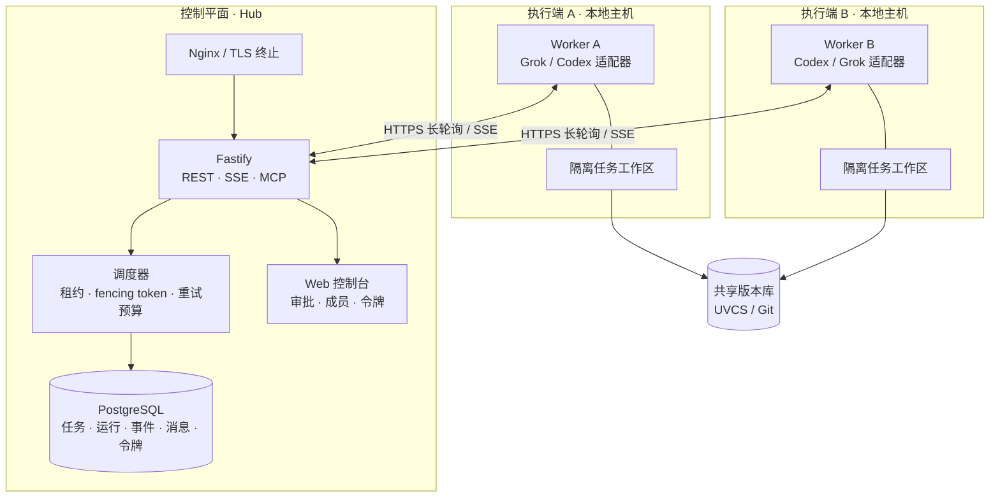
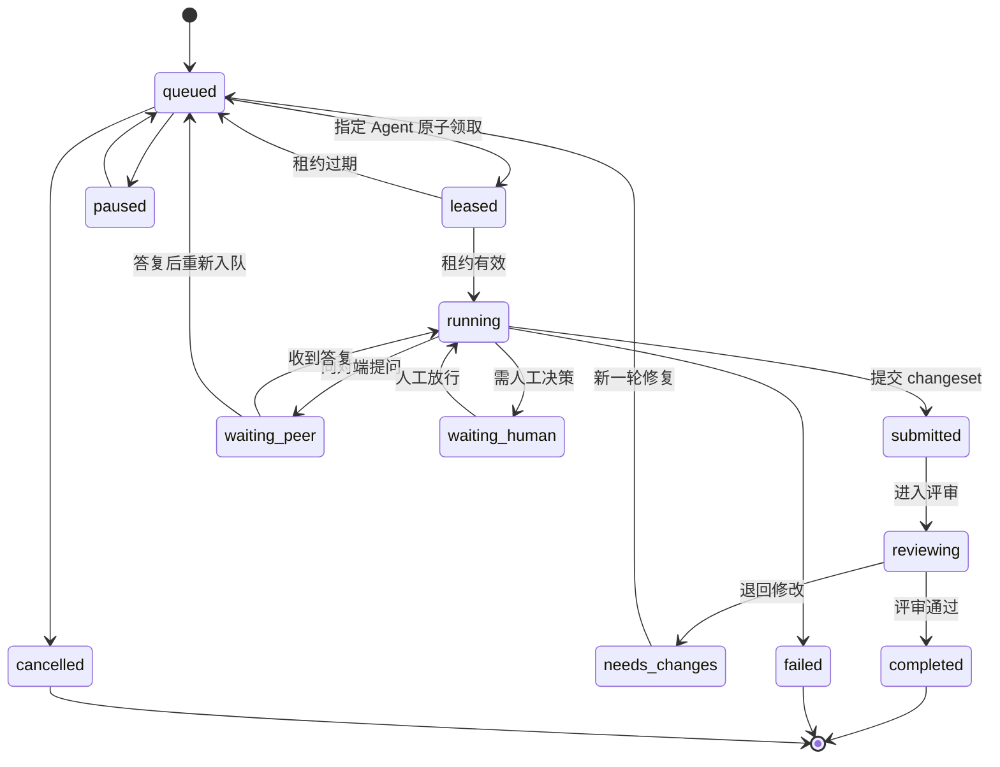
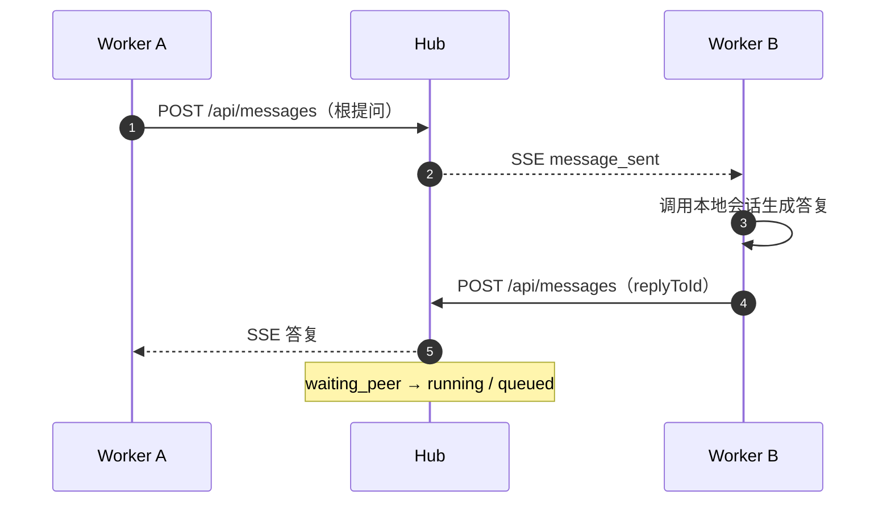

# 可编辑流程图源稿

下列为替换前的Mermaid源稿，供维护布局与语义参考。图2为简化示意，完整合法迁移以[契约状态表](../../packages/contracts/src/state-machine.ts)为准；进度线程的状态保留行为见README 4.5。

## 源稿1

```mermaid
flowchart TB
    subgraph CP["控制平面 · Hub"]
        direction TB
        NG["Nginx / TLS 终止"] --> API["Fastify<br/>REST · SSE · MCP"]
        API --> SCH["调度器<br/>租约 · fencing token · 重试预算"]
        SCH --> DB[("PostgreSQL<br/>任务 · 运行 · 事件 · 消息 · 令牌")]
        API --> UI["Web 控制台<br/>审批 · 成员 · 令牌"]
    end

    subgraph WA["执行端 A · 本地主机"]
        WKA["Worker A<br/>Grok / Codex 适配器"]
        WSA["隔离任务工作区"]
        WKA --- WSA
    end

    subgraph WB["执行端 B · 本地主机"]
        WKB["Worker B<br/>Codex / Grok 适配器"]
        WSB["隔离任务工作区"]
        WKB --- WSB
    end

    WKA <-->|"HTTPS 长轮询 / SSE"| API
    WKB <-->|"HTTPS 长轮询 / SSE"| API
    WSA --> VCS[("共享版本库<br/>UVCS / Git")]
    WSB --> VCS
```

## 源稿2

```mermaid
stateDiagram-v2
    [*] --> queued
    queued --> leased: 指定 Agent 原子领取
    leased --> running: 租约有效
    running --> submitted: 提交 changeset
    submitted --> reviewing: 进入评审
    reviewing --> completed: 评审通过
    reviewing --> needs_changes: 退回修改
    needs_changes --> queued: 新一轮修复
    running --> waiting_peer: 向对端提问
    waiting_peer --> running: 收到答复
    waiting_peer --> queued: 答复后重新入队
    running --> waiting_human: 需人工决策
    waiting_human --> running: 人工放行
    leased --> queued: 租约过期
    queued --> paused
    paused --> queued
    queued --> cancelled
    running --> failed
    completed --> [*]
    failed --> [*]
    cancelled --> [*]
```

## 源稿3

```mermaid
sequenceDiagram
    autonumber
    participant A as Worker A
    participant H as Hub
    participant B as Worker B

    A->>H: POST /api/messages（根提问）
    H-->>B: SSE message_sent
    B->>B: 调用本地会话生成答复
    B->>H: POST /api/messages（replyToId）
    H-->>A: SSE 答复
    Note over H: waiting_peer → running / queued
```